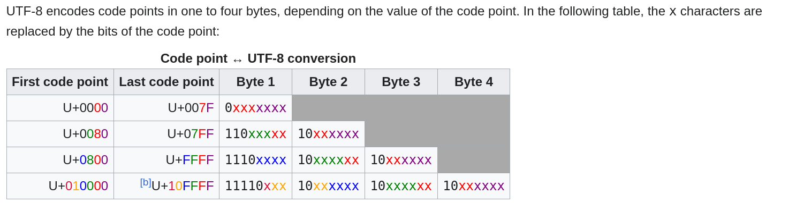

# Tokenizer notes

## Motivation

- Heart of much weirdness of LLMs.
- If LLM can't spell out words, tokenization issue
- worse at non-english languages
- Bad at simpe arithmetic
- Why did GPT-2 have trouble coding in Python? Tokenization
- LLm halts when it sees "<|endoftext|>"
- Trailing whites
- prefer YAML over JSON
- why it is not an end-to-end language modelling

- Gpt-2 tokenizer has a vocab of 50,257 (Distint tokens).
- Gpt-4 has almost double of that. So for the same text, gpt2 will have a lot of tokens with each token integer being less than 50k value. And gp4 will have half of those tokens for the same text but with each value spanning to higher values (upto vocab size)
- As a result, gpt4 can see a lot of prior context compared to gpt 2

`https://tiktokenizer.vercel.app/`

## Unicode

-   Characters in Python are based on Unicode code point which keeps updating and has around 150k different characters supported from english to marathi to emojis etc.
- `ord(char)` returns it's unicode code point integer value
- There are three types of Unicode Encodings (which translates unicode code points to it's binary representation), `UTF-8, UTF-16, UTF-32`.

- UTF-8 encoding is upto 4 Bytes of encoding (2^32) possibilities.
- UTF-32 is a fixed length encoding with lot's of trailing zeros

## Byte Pairing Algorithm

- We just iteratively pair most occuring pairs of same tokens and replace that with a new special token and add this special token to the vocabulary.

Example -> 

`aaabdaaabac`
tokens -> 11
vocab_size -> 4

we club `aa` and name it `Z` and add it tot vocab.
Now the sequence is- 
`ZabdZabac`
tokens -> 9
Vocab_size -> 5

club `Za` with `X`
`XbdXbac`
tokens -> 7
vocab_size -> 6

club `Xb` with `Q`
`QdQac`
tokens -> 5
vocab_size -> 7

- We keep increasing the vocab size and decreasing the number of tokens (decreasing the tokens is crucial because it means you can take a longer contect into transformer)
- As a result we will have fewer tokens but those integer tokens may have larger values now because vocab increased.

## Regular Expression (Regex)

- 